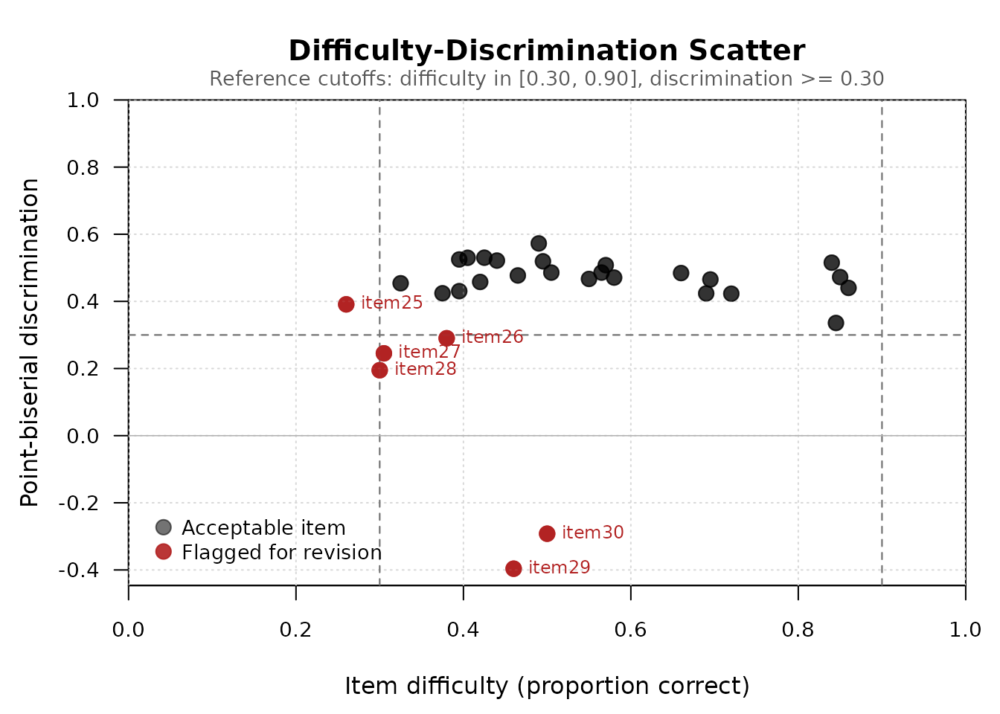

# Getting started with mcqAnalysis

## Overview

The **mcqAnalysis** package provides a unified toolkit for classical
test theory (CTT) item analysis of multiple-choice tests. It computes
item difficulty, item discrimination (point-biserial correlation and
upper-lower 27 percent discrimination index), per-distractor analysis,
and Haladyna’s distractor efficiency, and packages the results into a
tidy `mcq_analysis` object with dedicated `print`, `plot`, and
`apa_table` methods.

This vignette walks through a complete item analysis using the package’s
example dataset.

## Installation

Install the released version from CRAN:

``` r

install.packages("mcqAnalysis")
```

Or the development version from GitHub:

``` r

# install.packages("devtools")
devtools::install_github("Rafhq1403/mcqAnalysis")
```

## Example data

The package ships with `mcq_example`, a simulated 200-student, 30-item,
four-option multiple-choice test. The dataset is constructed so that
items span the full range of quality: easy items, ideal
medium-difficulty items, hard items with declining discrimination, and
two deliberately badly-written items with negative discrimination.

``` r

data(mcq_example)
str(mcq_example, max.level = 1)
#> List of 2
#>  $ responses: chr [1:200, 1:30] "D" "D" "D" "D" ...
#>   ..- attr(*, "dimnames")=List of 2
#>  $ key      : Named chr [1:30] "D" "D" "D" "A" ...
#>   ..- attr(*, "names")= chr [1:30] "item01" "item02" "item03" "item04" ...
mcq_example$key[1:6]
#> item01 item02 item03 item04 item05 item06 
#>    "D"    "D"    "D"    "A"    "D"    "B"
head(mcq_example$responses[, 1:6])
#>            item01 item02 item03 item04 item05 item06
#> student001 "D"    "D"    "D"    "A"    "D"    "B"   
#> student002 "D"    "D"    "D"    "A"    "A"    "B"   
#> student003 "D"    "D"    "C"    "A"    "D"    "B"   
#> student004 "D"    "D"    "D"    "A"    "D"    "B"   
#> student005 "D"    "D"    "D"    "A"    "D"    "B"   
#> student006 "D"    "D"    "D"    "A"    "D"    "B"
```

## Complete analysis with `mcq_analysis()`

The wrapper function
[`mcq_analysis()`](https://rafhq1403.github.io/mcqAnalysis/reference/mcq_analysis.md)
runs every item-level computation in a single call and returns an
`mcq_analysis` S3 object.

``` r

result <- mcq_analysis(mcq_example$responses, mcq_example$key)
result
#> Multiple-Choice Item Analysis
#> ------------------------------
#> Students: 200 
#> Items:    30 
#> Mean total score: 15.765  (SD = 6.342 )
#> 
#> Item-level statistics:
#>    item key difficulty point_biserial discrimination_index
#>  item01   D      0.850          0.472                0.426
#>  item02   D      0.860          0.440                0.370
#>  item03   D      0.845          0.336                0.296
#>  item04   A      0.840          0.515                0.537
#>  item05   D      0.720          0.423                0.556
#>  item06   B      0.695          0.465                0.593
#>  item07   D      0.690          0.424                0.593
#>  item08   A      0.660          0.484                0.611
#>  item09   D      0.580          0.471                0.685
#>  item10   C      0.565          0.486                0.722
#>  item11   B      0.570          0.508                0.648
#>  item12   A      0.550          0.467                0.667
#>  item13   C      0.495          0.519                0.704
#>  item14   B      0.505          0.486                0.741
#>  item15   D      0.425          0.530                0.759
#>  item16   A      0.395          0.431                0.630
#>  item17   A      0.465          0.477                0.685
#>  item18   D      0.420          0.458                0.704
#>  item19   A      0.490          0.573                0.759
#>  item20   D      0.440          0.522                0.741
#>  item21   B      0.375          0.424                0.648
#>  item22   B      0.325          0.454                0.611
#>  item23   D      0.405          0.530                0.704
#>  item24   D      0.395          0.525                0.741
#>  item25   A      0.260          0.391                0.519
#>  item26   C      0.380          0.290                0.389
#>  item27   D      0.305          0.245                0.296
#>  item28   A      0.300          0.195                0.259
#>  item29   C      0.460         -0.396               -0.407
#>  item30   D      0.500         -0.292               -0.296
#>  distractor_efficiency
#>                      2
#>                      1
#>                      2
#>                      2
#>                      3
#>                      3
#>                      3
#>                      3
#>                      3
#>                      3
#>                      3
#>                      3
#>                      3
#>                      3
#>                      3
#>                      3
#>                      3
#>                      3
#>                      3
#>                      3
#>                      3
#>                      3
#>                      3
#>                      3
#>                      3
#>                      3
#>                      3
#>                      3
#>                      1
#>                      1
```

The default print method shows test-level summaries (number of students,
number of items, mean and SD of total scores) and an item-level table
with difficulty, point-biserial, discrimination index, and distractor
efficiency.

## Visualizing item quality

The [`plot()`](https://rdrr.io/r/graphics/plot.default.html) method
produces a difficulty-discrimination scatter — the classical “item
quality map” used for visually identifying items that fall outside
conventional adequacy cutoffs. By default, only flagged items are
labeled, keeping the plot legible when many items cluster in the
acceptable region.

``` r

plot(result)
```



Items in **red** are flagged because they violate at least one of the
default adequacy criteria: difficulty outside \[0.30, 0.90\] or
discrimination below 0.30. Items 29 and 30 have *negative*
discrimination — high-ability students get them wrong more often than
low-ability students, indicating poorly written distractors or a
mis-keyed answer.

To label every item or to plot the upper-lower 27 percent discrimination
index instead of the point-biserial:

``` r

plot(result, label = "all")
plot(result, discrimination_metric = "discrimination_index")
```

## Per-distractor analysis

For diagnosing specific problematic items, the
[`distractor_analysis()`](https://rafhq1403.github.io/mcqAnalysis/reference/distractor_analysis.md)
function returns a per-option breakdown showing how each response option
performed.

``` r

da <- distractor_analysis(mcq_example$responses, mcq_example$key)
head(da, 8)
#>           item option is_key frequency proportion point_biserial
#> item01  item01      A  FALSE        10      0.050     -0.2670906
#> item011 item01      B  FALSE        12      0.060     -0.3234223
#> item012 item01      C  FALSE         8      0.040     -0.2505524
#> item013 item01      D   TRUE       170      0.850      0.5156325
#> item02  item02      A  FALSE        10      0.050     -0.2525847
#> item021 item02      B  FALSE         9      0.045     -0.2893215
#> item022 item02      C  FALSE         9      0.045     -0.2550078
#> item023 item02      D   TRUE       172      0.860      0.4838546
```

For each item-option combination, the output reports the option’s
selection frequency, the proportion of examinees choosing it, whether it
is the key, and its point-biserial correlation with the total test
score. The key should have a clearly positive point-biserial; each
distractor should have a non-trivial selection proportion and a negative
point-biserial.

Inspect a specific problematic item:

``` r

da[da$item == "item30", ]
#>           item option is_key frequency proportion point_biserial
#> item30  item30      A  FALSE        55      0.275     0.27246235
#> item301 item30      B  FALSE        21      0.105     0.04108455
#> item302 item30      C  FALSE        24      0.120    -0.07627404
#> item303 item30      D   TRUE       100      0.500    -0.21893362
```

## Distractor efficiency

[`distractor_efficiency()`](https://rafhq1403.github.io/mcqAnalysis/reference/distractor_efficiency.md)
summarizes the per-option analysis into a single integer per item: the
count of functioning distractors. A distractor is “functioning” if it is
selected by at least 5 percent of examinees and has a negative
point-biserial with the total score (Haladyna & Downing, 1993).

``` r

de <- distractor_efficiency(mcq_example$responses, mcq_example$key)
de[1:10]
#> item01 item02 item03 item04 item05 item06 item07 item08 item09 item10 
#>      2      1      2      2      3      3      3      3      3      3
```

For a four-option item, distractor efficiency ranges from 0 (no
functioning distractors — the item is essentially a two-option item) to
3 (all three distractors functioning — the item is performing at full
capacity).

## Publication-ready output with `apa_table()`

The
[`apa_table()`](https://rafhq1403.github.io/mcqAnalysis/reference/apa_table.md)
method formats the item analysis as a publication-ready APA-style table
in data-frame, markdown, HTML, or LaTeX form.

``` r

apa_table(result, format = "data.frame")[1:8, ]
#>     Item Key Difficulty Point-biserial Discrimination D Distractor Efficiency
#> 1 item01   D       0.85           0.47             0.43                     2
#> 2 item02   D       0.86           0.44             0.37                     1
#> 3 item03   D       0.84           0.34             0.30                     2
#> 4 item04   A       0.84           0.52             0.54                     2
#> 5 item05   D       0.72           0.42             0.56                     3
#> 6 item06   B       0.70           0.47             0.59                     3
#> 7 item07   D       0.69           0.42             0.59                     3
#> 8 item08   A       0.66           0.48             0.61                     3
#>   Difficulty Level Discrimination
#> 1         Moderate      Excellent
#> 2         Moderate      Excellent
#> 3         Moderate           Good
#> 4         Moderate      Excellent
#> 5         Moderate      Excellent
#> 6         Moderate      Excellent
#> 7         Moderate      Excellent
#> 8         Moderate      Excellent
```

The data-frame output includes interpretive columns based on
conventional CTT cutoffs (Ebel & Frisbie, 1991). For inclusion in an R
Markdown manuscript:

``` r

apa_table(result, format = "markdown")
```

## Individual functions

If you do not need the full wrapper, each component statistic is
available as a standalone function:

``` r

item_difficulty(mcq_example$responses, mcq_example$key)[1:6]
#> item01 item02 item03 item04 item05 item06 
#>  0.850  0.860  0.845  0.840  0.720  0.695
point_biserial(mcq_example$responses, mcq_example$key)[1:6]
#>    item01    item02    item03    item04    item05    item06 
#> 0.4723679 0.4401658 0.3356581 0.5153377 0.4228731 0.4652371
item_discrimination(mcq_example$responses, mcq_example$key,
                    method = "discrimination_index")[1:6]
#>    item01    item02    item03    item04    item05    item06 
#> 0.4259259 0.3703704 0.2962963 0.5370370 0.5555556 0.5925926
```

All functions share the same input convention: a matrix or data frame of
student responses (students in rows, items in columns) and a vector of
correct answers with one entry per item.

## References

Ebel, R. L., & Frisbie, D. A. (1991). *Essentials of educational
measurement* (5th ed.). Prentice Hall.

Haladyna, T. M. (2004). *Developing and validating multiple-choice test
items* (3rd ed.). Lawrence Erlbaum Associates.

Haladyna, T. M., & Downing, S. M. (1993). How many options is enough for
a multiple-choice test item? *Educational and Psychological
Measurement*, 53(4), 999-1010.

Kelley, T. L. (1939). The selection of upper and lower groups for the
validation of test items. *Journal of Educational Psychology*, 30(1),
17-24.
